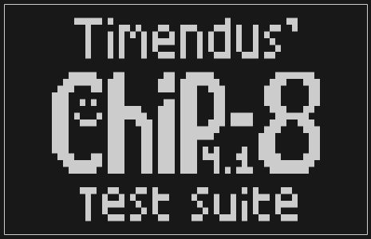

# Chip 8 Emulator written in C++

The emulator is technically headless, but it can be easily adapted to display on a screen. In this case, it's the terminal!

The emulator library is in the `libraries\chip8++` folder, with the main system and instructions in seperate folder within there.

The main program and especially the implementation to use the terminal as a display is in the `src` folder.

Documentation is still early but the emulator is functional and passes the test-suite roms.

This project can be built using cmake and is VSCode friendly. Be aware that a C++23 compiler is required.