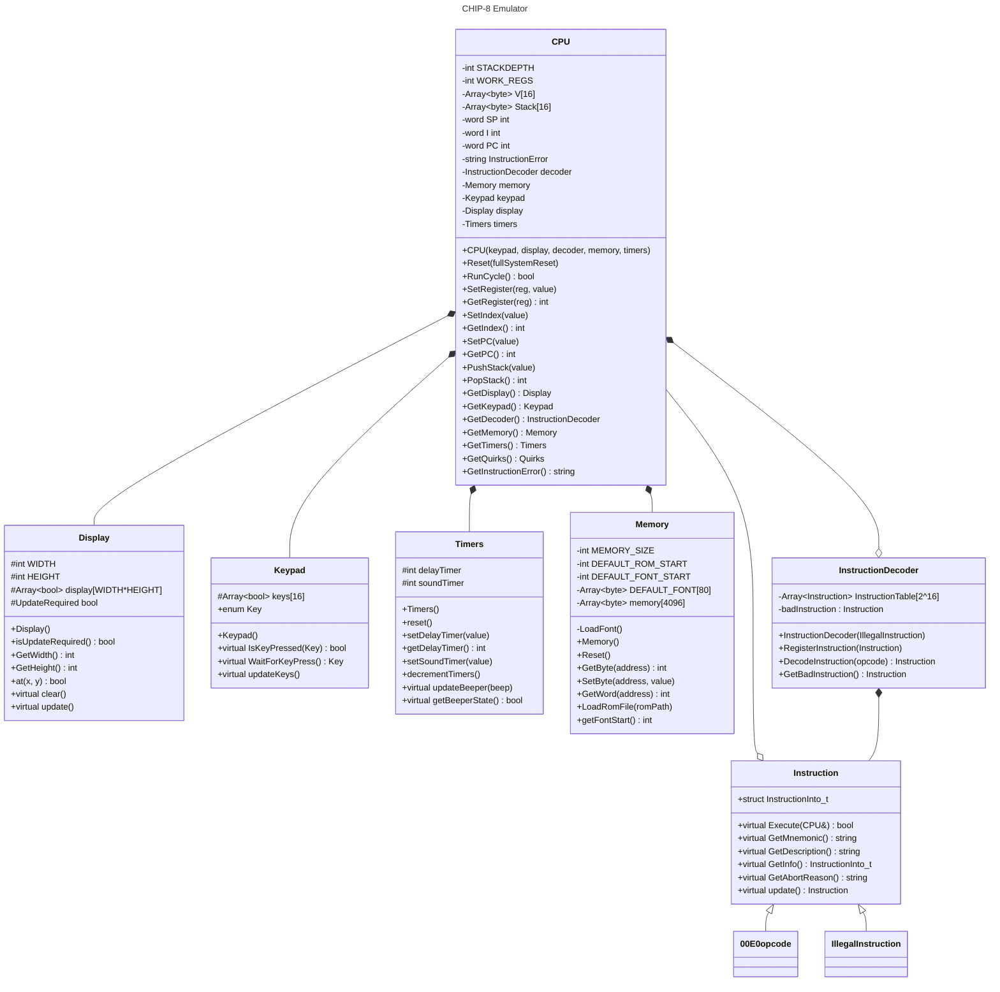

### Class Diagram
The class diagram looks as following:

```mermaid
---
title: CHIP-8 Emulator
---
classDiagram
    
	CPU *-- Display
    CPU *-- Keypad
    CPU *-- Timers
    CPU *-- Memory
    CPU *--o InstructionDecoder

    CPU --o Instruction

    Instruction <|-- 00E0 opcode
	Instruction <|-- IllegalInstruction
    
    InstructionDecoder *-- Instruction

    class InstructionDecoder {
		-Array~Instruction~ InstructionTable[2^16]
		-badInstruction : Instruction
		+InstructionDecoder(IllegalInstruction)
		+RegisterInstruction(Instruction)
        +DecodeInstruction(opcode) Instruction
		+GetBadInstruction() Instruction
    }

    class Instruction{
		+struct InstructionInto_t
        +virtual Execute(CPU&) bool
        +virtual GetMnemonic() string
		+virtual GetDescription() string
		+virtual GetInfo() InstructionInto_t
		+virtual GetAbortReason() string
		+virtual update() Instruction
    }

	class IllegalInstruction{
	}

    class 00E0 opcode{
    }

    class CPU{
		-int STACKDEPTH
		-int WORK_REGS
		-Array~byte~ V[16]
        -Array~byte~ Stack[16]
        -word SP int
        -word I int
        -word PC int
		-string InstructionError
		-InstructionDecoder decoder
		-Memory memory
		-Keypad keypad
		-Display display
		-Timers timers
		+CPU(keypad, display, decoder, memory, timers)
		+Reset(fullSystemReset)
		+RunCycle() bool
		+SetRegister(reg, value)
		+GetRegister(reg) int
		+SetIndex(value)
		+GetIndex() int
		+SetPC(value)
		+GetPC() int
		+PushStack(value)
		+PopStack() int
		+GetDisplay() Display
		+GetKeypad() Keypad
		+GetDecoder() InstructionDecoder
		+GetMemory() Memory
		+GetTimers() Timers
		+GetQuirks() Quirks
		+GetInstructionError() string
    }

	class Memory {
		-int MEMORY_SIZE
		-int DEFAULT_ROM_START
		-int DEFAULT_FONT_START
		-Array~byte~ DEFAULT_FONT[80]
		-Array~byte~ memory[4096]
		-LoadFont()
		+Memory()
		+Reset()
		+GetByte(address) int
		+SetByte(address, value)
		+GetWord(address) int
		+LoadRomFile(romPath)
		+getFontStart() int
	}
    
    class Keypad {        
		#Array~bool~ keys[16]
		+enum Key
		+Keypad()
        +virtual IsKeyPressed(Key) bool
        +virtual WaitForKeyPress() Key
		+virtual updateKeys()
    }

    class Display {
		#int WIDTH
		#int HEIGHT
        #Array~bool~ display[WIDTH*HEIGHT]
		#UpdateRequired bool
		+Display()
		+isUpdateRequired() bool
        +GetWidth() int
		+GetHeight() int
		+at(x, y) bool
		+virtual clear()
        +virtual update()
    }

    class Timers {
        #int delayTimer
        #int soundTimer
		+Timers()
        +reset()
		+setDelayTimer(value)
		+getDelayTimer() int
		+setSoundTimer(value)
		+decrementTimers()
		+virtual updateBeeper(beep) 
		+virtual getBeeperState() bool
    }
```
