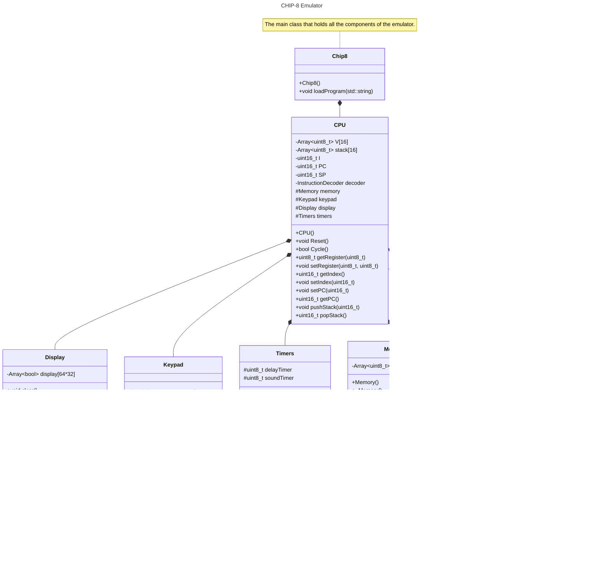

# CHIP-8 Emulator (OUTDATED)

### Class Diagram
The class diagram looks as following:

```mermaid
---
title: CHIP-8 Emulator
---
classDiagram

    note for Chip8 "The main class that holds all the components of the emulator."
    
	Chip8 *-- CPU

    CPU *-- Display
    CPU *-- Keypad
    CPU *-- Timers
    CPU *-- Memory
    CPU *--o InstructionDecoder

    CPU --o Instruction

    Instruction <|-- 00E0 opcode
	Instruction <|-- IllegalInstruction
    
    InstructionDecoder *-- Instruction

    class Chip8 {
        +Chip8()
        +void loadProgram(std::string)
    }

    class InstructionDecoder {
		-Array~Instruction~ InstructionTable[2^16]
		+InstructionDecoder()
		+void registerInstruction(Instruction)
        +Execute(&CPU)
        +opcode* decode(uint16_t)
    }

    class Instruction{
        virtual bool Execute(CPU&)
        virtual string getMnemonic()
		virtual OpCodeInfo getInfo()
		virtual Instruction* update()
    }

	class IllegalInstruction{
	}

    class 00E0 opcode{
    }

    class CPU{
        -Array~uint8_t~ V[16]
        -Array~uint8_t~ stack[16]
        -uint16_t I
        -uint16_t PC
        -uint16_t SP
		-InstructionDecoder decoder
		#Memory memory
		#Keypad keypad
		#Display display
		#Timers timers
		+CPU()
		+void Reset()
		+bool Cycle()
		+uint8_t getRegister(uint8_t)
		+void setRegister(uint8_t, uint8_t)
		+uint16_t getIndex()
		+void setIndex(uint16_t)
		+void setPC(uint16_t)
		+uint16_t getPC()
		+void pushStack(uint16_t)
		+uint16_t popStack()
    }

	class Memory {
		-Array~uint8_t~ memory[4096]
		+Memory()
		+~Memory()
		+void fillMemory()
		+void loadProgram(std::string)
		+void loadBinary(std::string)

	}
    
    class Keypad {        
        virtual uint8_t getKeyState()
        virtual uint8_t waitForKeyPress()
    }

    class Display {
        -Array~bool~ display[64*32]
        +void clear()
        +void draw(uint8_t, uint8_t, uint8_t)
        virtual void update()
    }

    class Timers {
        #uint8_t delayTimer
        #uint8_t soundTimer

        +void reset()
        +virtual void update()
        +virtual void beepToggle(bool)
    }
```
